# Project Title

API-Basiced-Digital-Subscription-Share-Without-Credential

## Table of Contents
- [Features](#features)
- [Demo Screenshots](#demo-screenshots)
- [Installation](#installation)

## Features
- Feature 1: Create Customar Account
- Feature 2: Create Product which you want to share
- Feature 3: Extension Based
- User authentication and authorization
- Device management
- Product management

## Demo Screenshots

### Screenshot 1: Login Screen

### Screenshot 2: User Dashboard

### Screenshot 3: Create Users

### Screenshot 4: Create Products

## How to Use 
1. 1st Go to Extension Download in the Left Sideber
2. ### Screenshot 5: Download Extension
   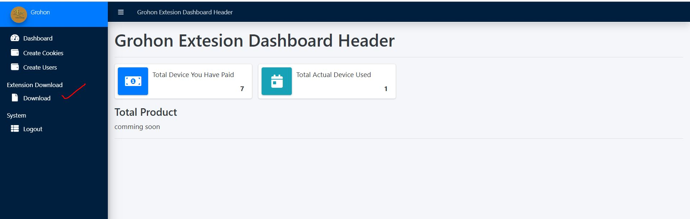

3. Dowload the Extension Top header

4.Extract Zip File and Install Chrome Browser  in the Extension Seassion in the Chrome(Turn On Development Mode)
### Screenshot 6: Extension Install Process
 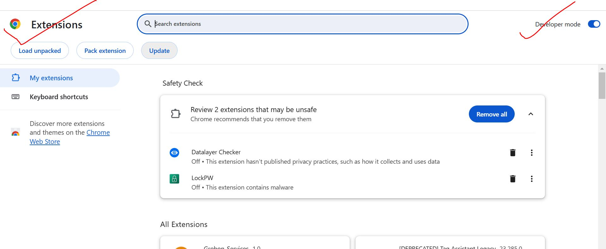
  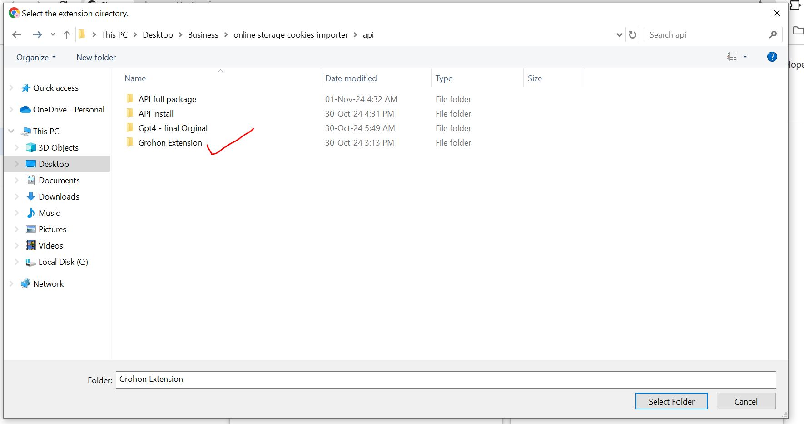
   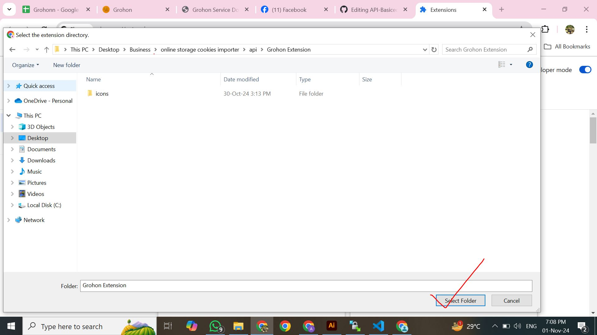
    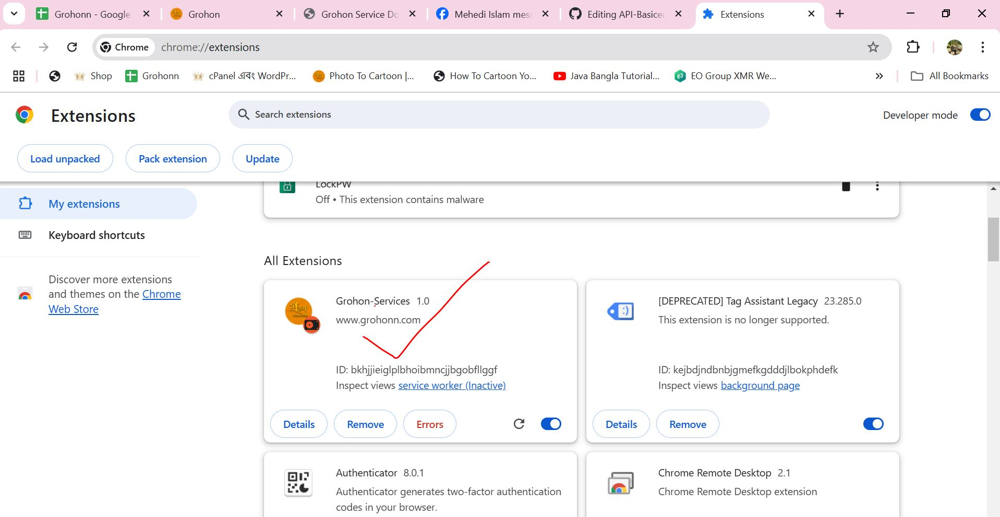 

### How to Share Digital Product. For Example: Facebook Account Share your friend Without Any Credential
1. 1st Go to Facebook and Login Account
2. Then go to google extension Store and Search Cookies Editor
### Screenshot 7: Install Cookies Editor
 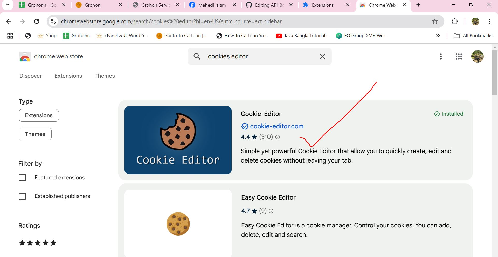

 3. After Allow Access then go to Facebook Account then Open the Cookies Editor
### Screenshot 8: Collect Cookies
 

 ### Screenshot 9: Export Cookies And Auto Copy
 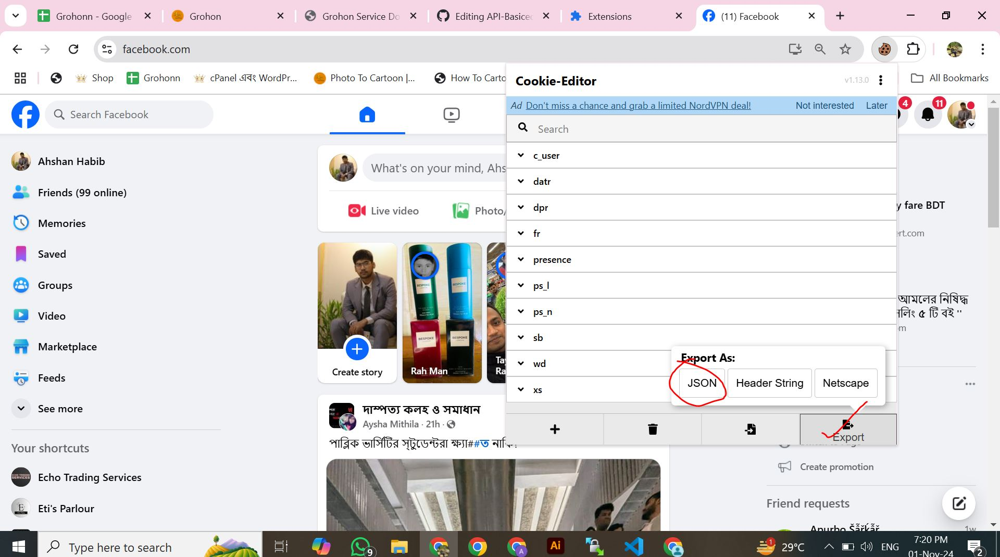 

  ### Now Go to Your Website  Create Product with url and Cookies
 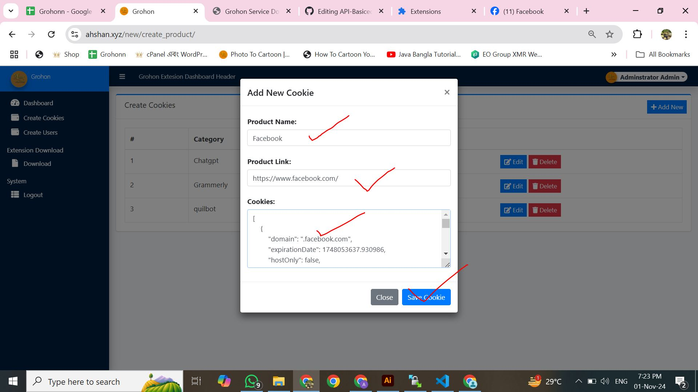 

  ### Now Create Users Where You want to share
 ### Screenshot 10:Create Users
 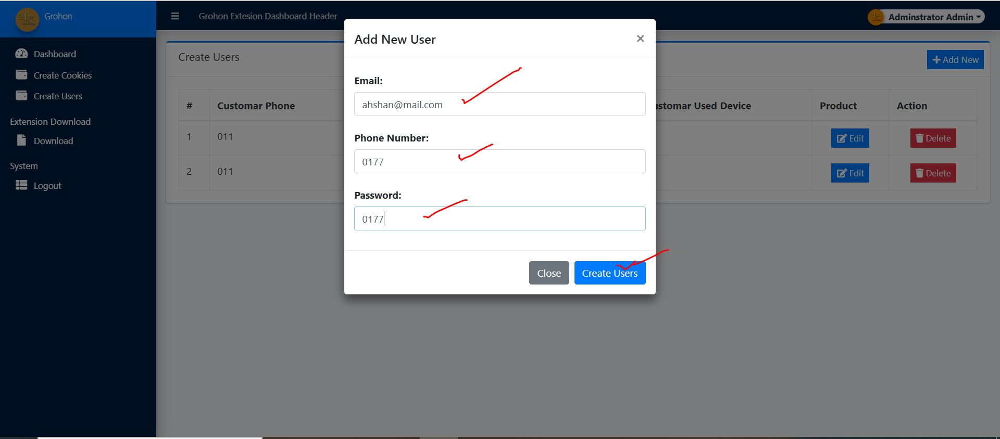 

 ### Screenshot 11:EDIT Users
 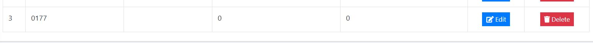 

 ### Screenshot 12:EDIT Extension Details. Please Wait 1 min then Automatic Active
 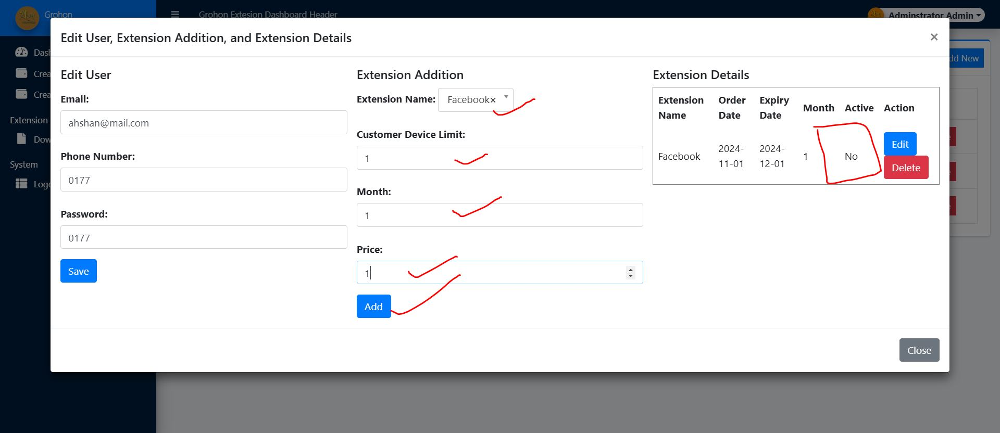 

 ### Screenshot 13:EDIT Extension Details. Please Wait 1 min then Automatic Active
Now Share Your Extension Where You Want to Share with UserName and Password. Username is phone number where you Recently create Account

 ### Now Another PC Open Extension 
### Screenshot 14:Grohon Extension
 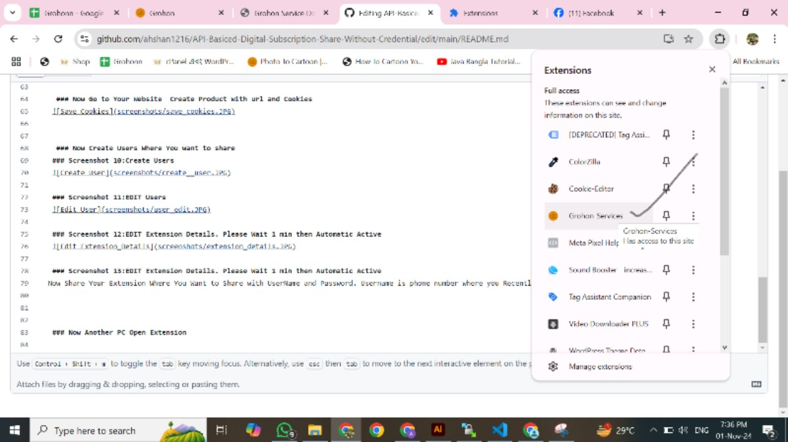 

### Screenshot 15:Enter Your Phone and Pass
 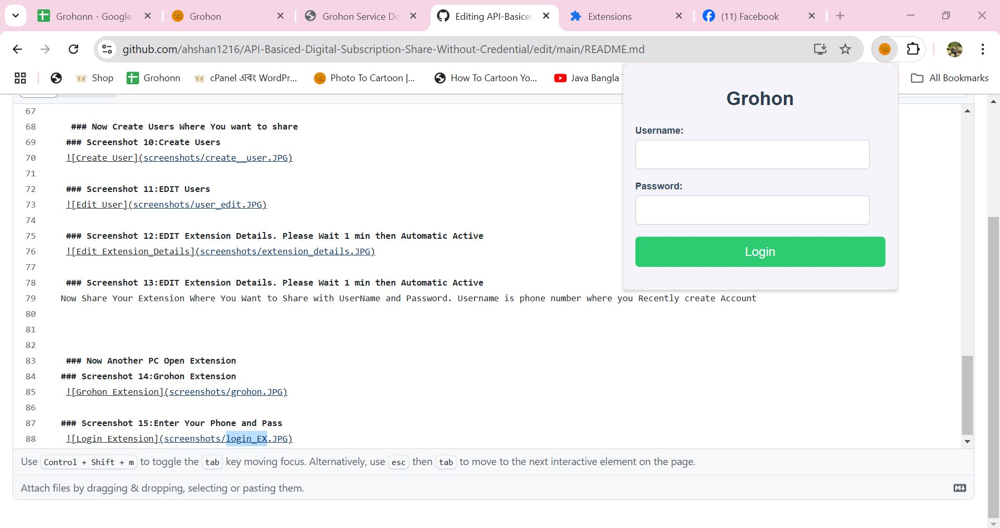 

### Enter Your Phone and Pass then Show the Product (example:Fscebook) When you click the product your Target Customar Open facebook without any password

Name: MD AHSHAN HABIB
This is API based Website
If you Need Complate Website Just know me 
facebook.com/ahshanhabib00
