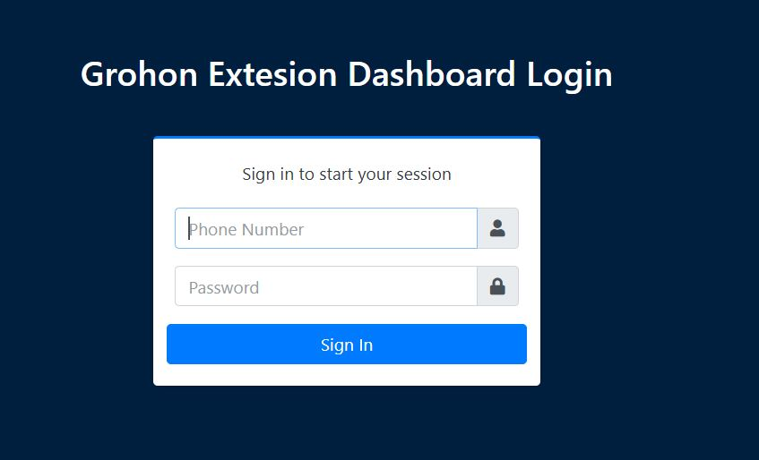
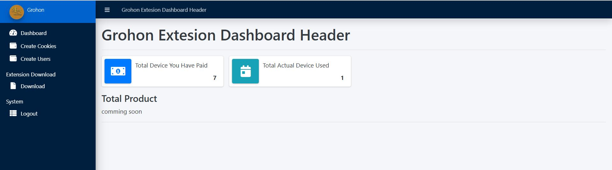
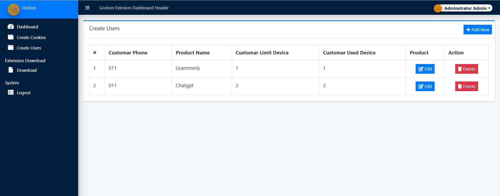
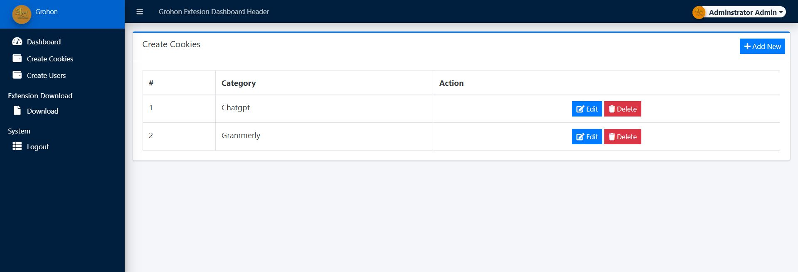

# Project Title

API-Basiced-Digital-Subscription-Share-Without-Credential

## Table of Contents
- [Features](#features)
- [Demo Screenshots](#demo-screenshots)
- [Installation](#installation)
- [Usage](#usage)
- [API Reference](#api-reference)
- [Contributing](#contributing)
- [License](#license)

## Features
- Feature 1: Create Customar Account
- Feature 2: Create Product which you want to share
- Feature 3: Extension Based
- User authentication and authorization
- Device management
- Product management

## Demo Screenshots

### Screenshot 1: Login Screen

### Screenshot 2: User Dashboard

### Screenshot 3: Create Users

### Screenshot 4: Create Products

